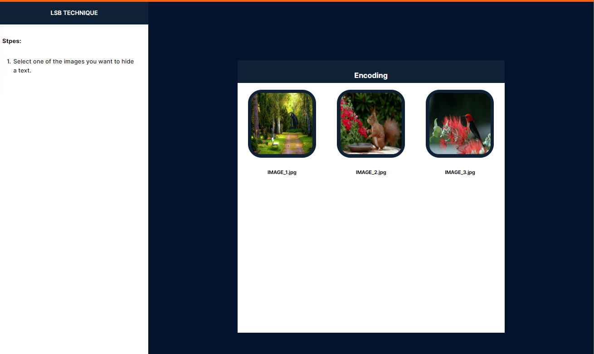
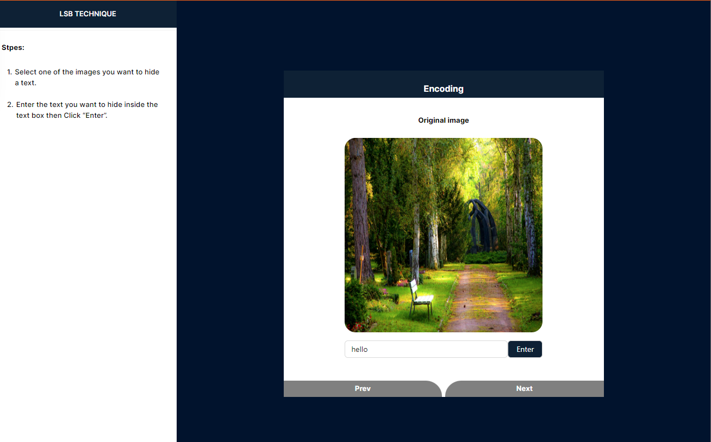
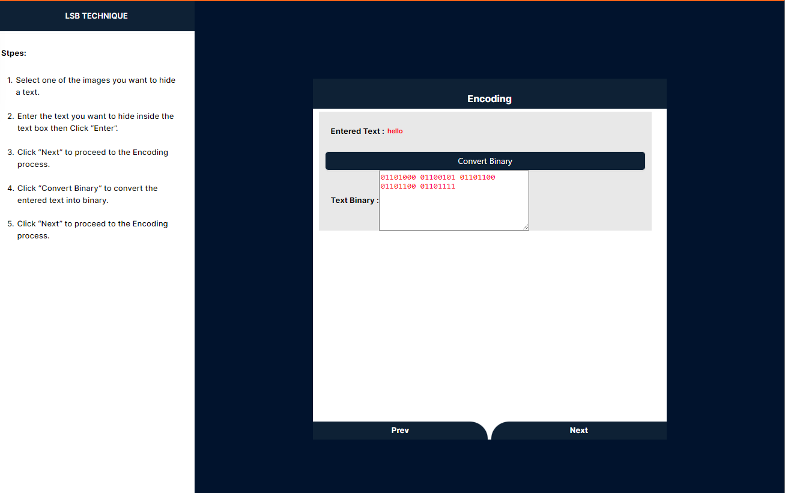
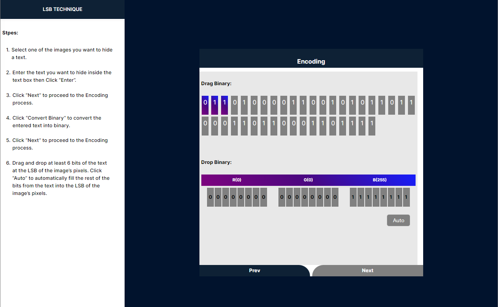
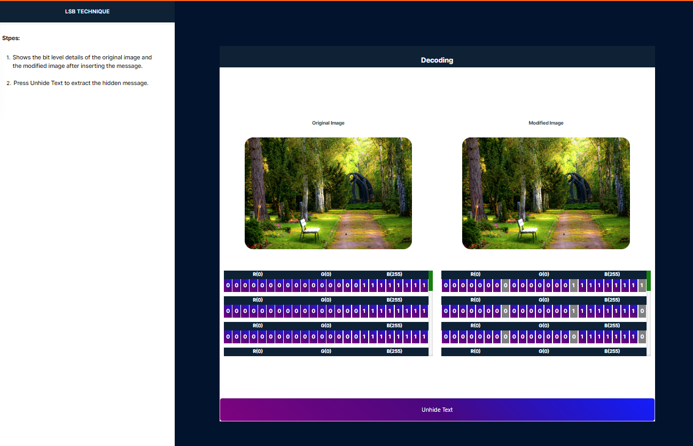
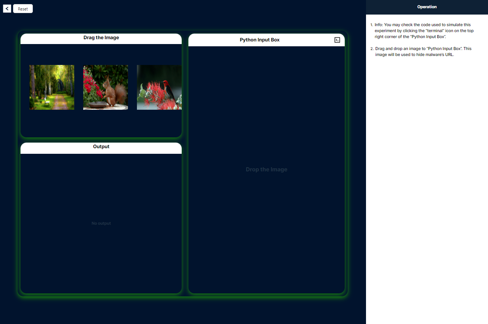
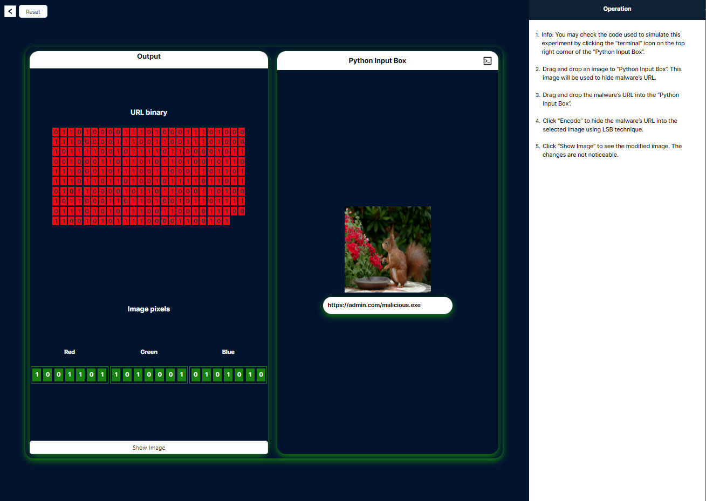
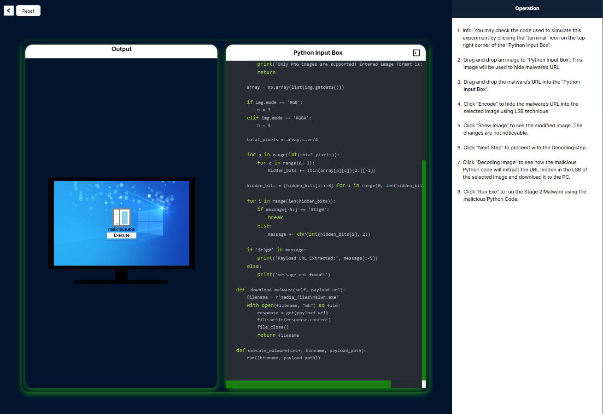
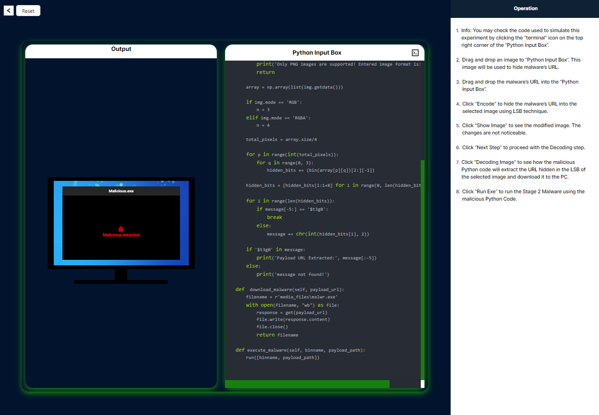

# Procedure for Hiding and Unhiding Data Using the Least Significant Bit (LSB) Technique

The Least Significant Bit (LSB) technique is a method used in steganography to hide data within an image by modifying the least significant bits of the image's pixel values. Here's a brief explanation of how to hide and unhide data using the LSB technique in four lines:

## Hiding Data Using LSB Technique

### Convert Data to Binary

Convert the data you want to hide into its binary form. For example, if you're hiding text, convert each character to its ASCII binary equivalent.

### Modify Image Pixels

For each bit of the binary data, modify the least significant bit of the image's pixel values. For instance, if the pixel value is 255 (binary: 11111111) and the data bit is 0, change the pixel value to 254 (binary: 11111110).

### Embed Data Sequentially

Continue embedding each bit of the binary data into the least significant bits of the image pixels, moving sequentially through the image.

### Save the Modified Image

Save the modified image with the embedded data. The image will appear unchanged to the human eye but will contain the hidden data.

## Unhiding Data Using LSB Technique

### Load the Modified Image

Load the image that contains the hidden data.

### Extract LSBs

Extract the least significant bits from the pixel values of the image. These bits contain the hidden data.

### Reconstruct Binary Data

Combine the extracted bits to reconstruct the binary form of the hidden data.

### Convert Binary to Original Data

Convert the binary data back to its original form (e.g., text), revealing the hidden message.

---

## Step-by-Step Guide

### 1. Select the Image

**To initiate the simulation, please select the image in which the text will be hidden within the image pixels. The corresponding steps will be displayed on the left side.**

### 2. Enter the Text

**Please enter the text you would like to conceal within the image, then click 'Enter'. Afterward, click 'Next' to proceed to the following step.**

### 3. Convert Text to Binary

**Follow these steps to convert your text to binary format. Click "Convert to Binary" to initiate the conversion. After the conversion is complete, click "Next" to proceed to the following step.**

### 4. Embed Binary Data into Image Pixels

**This step involves the primary process of dragging each binary and dropping the last bit of red, green, and blue twice. Once completed, the 'Auto' button will be enabled, allowing you to automatically drag and drop all the binaries into the image.**

### 5. Encode or Decode the Image

**To proceed, click the "Encode" button if you want to perform the encoding step. If you wish to view the modified image, click "Download" to download the image. Alternatively, click the "Decode" button to initiate the decoding process.**

### 6. Compare Original and Modified Images

**This process involves encoding an image to conceal hidden text. By comparing the original and modified images, you can observe that the least significant bit of each color byte has been altered in the modified image. This subtle change in the pixel values enables the storage of the hidden text within the image.**

### 7. Reveal Hidden Text

**Please click the "Unhide Text" button to reveal the hidden text from the image. After that, in the left panel, you will see two buttons labeled "Real Time Simulation" and "Encode." Click the "Real Time Simulation" button to go to the simulation, or click the "Encode" button to encode a new image.**

### 8. Interface Features

**The interface features a reset button that allows you to reset the simulation, and a back button that enables you to return to the decoding process. At the bottom, there are three containers: a draggable container, a drop container, and an output container. On the left side, a panel displays the steps to guide you through the process.**

- To process an image, simply drag and drop it into the Python input box, and the corresponding output will be displayed in the output container.
- To process a URL, simply drag and drop it into the Python input box, and the corresponding output will be displayed in the output container.

### 9. Encode URL into Image

**Click the "Encode" button located beneath the Python image box container. This action will convert the URL to binary and embed the binary data into the image.**

### 10. View Modified Image

**Click the "Show Image" button to view the modified image, and then click "Next Step" to proceed to the decoding process.**

### 11. Decode the Image

**Upon clicking the "Decode" button, the corresponding function in the Python code on the right side will be highlighted in red and executed.**

### 12. Initiate Malware Download

**To initiate the malware download, please click on the designated download link, which will retrieve the executable file from the decoded URL.**

### 13. Execute the Downloaded File

**Click the "Execute" button to run the downloaded .exe file on your computer.**

### 14. Run Malware-Detection Executable

**Once the URL is accessed, the malware-detection executable can be executed to ensure the system's security.**

